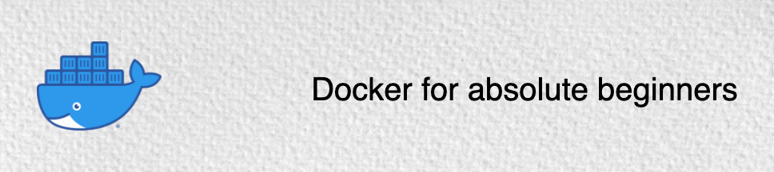
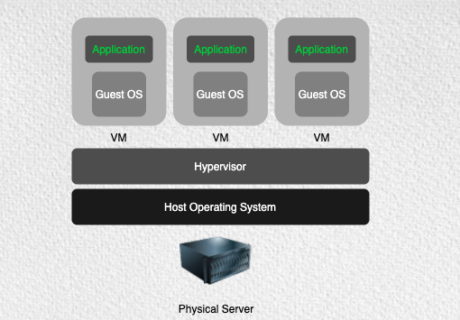
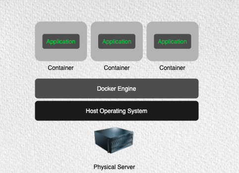

### Introduction

Docker is an operating system container management tool that allows you to easily manage and deploy applications by making it easy to package them within operating system containers. Docker Containers has changed the way software is built and shipped.  

From a developer's point of view, it makes his life much easier to built and ship the software packages which will run anywhere. No longer need to worry about local and server environments.From the operation's point of view, we no longer need to worry about dependencies and system management. Run the containers anywhere without any hazards. From the business point of view, containers fastened the development and release of life-cycles. 

### History of containers

Evolution of Containers

- 1979: Unix V7 - chroot system calls
    
    During the development of Unix V7 in 1979, the chroot system call was introduced, changing the root directory of a process and its children to a new location in the filesystem. This advance was the beginning process isolation: segregating file access for each process. Chroot was added to BSD in 1982.

- 2000: FreeBSD Jails

    In 2000, a small shared hosting provider came up with FreeBSD jails to achieve clear-cut separation between its services and those of its customers for security and ease of administration. FreeBSD Jails allows administrators to partition a FreeBSD computer system into several independent, smaller systems – called “jails” – with the ability to assign an IP address for each system and configuration.

- 2001: Linux VServer

    Linux VServer is a jail mechanism that can partition resources (file systems, network addresses, memory) on a computer system.  This operating system virtualization is implemented by patching the Linux kernel.

- 2004: Solaris Containers

    In 2004, the first public beta of Solaris Containers was released that combines system resource controls and boundary separation provided by zones, which were able to leverage features like snapshots and cloning from ZFS.

- 2005 : Open VZ (Open Virtuzzo

    This is an operating system-level virtualization technology for Linux which uses a patched Linux kernel for virtualization, isolation, resource management and checkpointing. The code was not released as part of the official Linux kernel.

-  2006: Process Containers
    
    Process Containers (launched by Google in 2006) was designed for limiting, accounting and isolating resource usage (CPU, memory, disk I/O, network) of a collection of processes. It was renamed “Control Groups (cgroups)” a year later and eventually merged to Linux kernel 2.6.24.

- 2008: LXC

    LXC (LinuX Containers) was the first, most complete implementation of Linux container manager. It was implemented in 2008 using cgroups and Linux namespaces, and it works on a single Linux kernel without requiring any patches.

- 2011: Warden

    CloudFoundry started Warden in 2011, using LXC in the early stages and later replacing it with its own implementation. Warden can isolate environments on any operating system, running as a daemon and providing an API for container management. It developed a client-server model to manage a collection of containers across multiple hosts, and Warden includes a service to manage cgroups, namespaces and the process life cycle.

- 2013: LMCTFY
    
    Let Me Contain That For You (LMCTFY) kicked off in 2013 as an open-source version of Google's container stack, providing Linux application containers. Applications can be made “container aware,” creating and managing their own subcontainers. Active deployment in LMCTFY stopped in 2015 after Google started contributing core LMCTFY concepts to libcontainer, which is now part of the Open Container Foundation.

- 2013: Docker
    
    When Docker emerged in 2013, containers exploded in popularity. It’s no coincidence the growth of Docker and container use goes hand-in-hand. Docker also used LXC in its initial stages and later replaced that container manager with its own library, libcontainer. But there’s no doubt that Docker separated itself from the pack by offering an entire ecosystem for container management.

- 2017: Container Tools Become Mature
    
    Hundreds of tools have been developed to make container management easier. While these types of tools have been around for years, 2017 is the year that many of them earned their stripes. Just look at Kubernetes; since its adoption into the Cloud Native Computing Foundation (CNCF) in 2016.

 

### Why Containers

  

The Old Way to deploy applications was to install the applications on a host using the operating system package manager. This had the disadvantage of entangling the applications' executables, configuration, libraries and life cycles with each other and with the host OS. One could build immutable virtual machines(VM) in order to achieve predictable rollouts and rollbacks, but VMs are heavyweight and non-portable.

The New Way is to deploy containers based on operating system level virtualization rather than hardware virtualization. These containers are isolated from each other and from the host.
- they have their own filesystem
- they can't see each others processes
- their computational resource usage can be bounded

They are easier to build than VMs, and because they are decoupled from the underlying infrastructure and from the host filesystem, they are portable across public IAAS clouds and OS distributions.

   

### Getting started with Docker - Introduction

Docker containers wrap a piece of software in a complete filesystem that contains everything needed to run: code, runtime, system tools, system libraries and anything that can be installed on a server. This guarantees that the software will always run the same, regardless of its environment.

Run your first docker container

`docker run hello-world`

- When you run docker run command
  - Docker engine checks if the image is available or not
  - If image is not available, docker engine will pull from docker registry 
  - If image is available, docker engine will run the command locally

   

### How Docker Works?

- Docker is the program that enables containers to be built, shipped and run 
- Docker Engine uses Linux Kernel namespaces and control groups

   

### Terminology
- Docker Image
  - Read only file with OS, libraries and apps
  - Anyone can create a docker image
  - Images can be stored in Docker hub (default public registry) or private registry
- Docker Container
  - Stateful instance of an image with a writable layer Contains everything needed to  run your application Based on one or more images
- Docker Registry 
  - Repository of images
- Docker Hub
  - Public docker registry

   

### What is Docker Hub?
Docker Hub is the public registry that contains a large number of images available for your use.

   

### Docker Search

You can also search through all publicly available images in docker hub.

`docker search wpscan`

   

### Some docker commands

 List all running containers 

`docker ps`

 List all running and stopped containers 

`docker ps -a`

 Run a container interactively 

`docker run --name samplecontainer -it ubuntu:latest /bin/bash`

 List all images

`docker images`

 Run container in detached mode 

`docker run --name pingcontainer -d alpine:latest ping 127.0.0.1 -c 50`

 Live tail logs inside a container 

`docker logs -f pingcontainer `

 Port forwarding 

`docker run -d --name nginxalpine -p 8080:80 nginx:alpine`

 List volumes 

`docker volume ls`

 List network 

`docker network ls`

   

### Inspecting a container image

Returns low-level information on Docker objects 

  `docker inspect <container name> `

  `docker inspect <image name>`

Let's inspect the nginx:alpine image

  
`docker inspect nginx:alpine`

### Docker history

 Show the history of an image 

`docker history jess/htop`

### Stopping and remove container

Let's run a nginx container

 `docker run --name dummynginx -d nginx:alpine`

Identify the container name or id using `docker ps`

`docker stop dummynginx`

To remove container, it has to be stopped. Then run the below command

`docker rm dummynginx`

   

### Namespaces
Docker uses namespaces to provide the isolated workspace called the container. When you run a container, Docker creates a set of namespaces for that container.
- The pid namespace: Process isolation (PID: Process ID)
- The net namespace: Managing network interfaces (NET: Networking)
- The ipc namespace: Managing access to IPC resources (IPC: InterProcess Communication
- The mnt namespace: Managing filesystem mount points (MNT: Mount)
- The uts namespace: Different host and domain names (UTS: Unix Timesharing System)
- The user namespace: Isolate security-related identifiers (USER: userid, groupid)

   

### Why Kubernetes
A lot of developers have moved or are moving from a traditional world to a container based ecosystem. This allows developers to package their application code, dependencies and required libraries in a simple container and use it anywhere wherever there is a container runtime available.

An example of a container runtime is Docker

At a minimum, Kubernetes can schedule and run application containers on clusters of physical or virtual machines. However, Kubernetes also allows developers to ‘cut the cord’ to physical and virtual machines, moving from a host- centric infrastructure to a container-centric infrastructure.

This approach provides the full advantages and benefits inherent to containers. Kubernetes provides the infrastructure to build a truly container centric development environment. This is the primary reason developers love it.

   

### What is Kubernetes
With Kubernetes, you are able to quickly and efficiently respond to customer demand
- Deploy your applications quickly and predictably
- Scale your applications on the fly
- Roll out new features seamlessly
- Limit hardware usage to required resources only
- Our goal is to foster an ecosystem of components and tools that relieve the burden of running applications in public and private clouds

According to Brian Grant Kubernetes is an open-source platform designed to automate deploying, scaling, and operating application containers.

Kubernetes is
- Portable: public, private, hybrid, multi-cloud
- Extensible: modular, pluggable, hookable, composable
- Self-healing: auto-placement, auto-restart, auto-replication, auto-scaling

   

References

1. [A Brief History of Containers](https://blog.aquasec.com/a-brief-history-of-containers-from-1970s-chroot-to-docker-2016)
1. [Docker overview](https://docs.docker.com/get-started/overview/)
1. [Kubernetes overview](https://kubernetes.io/docs/home/)